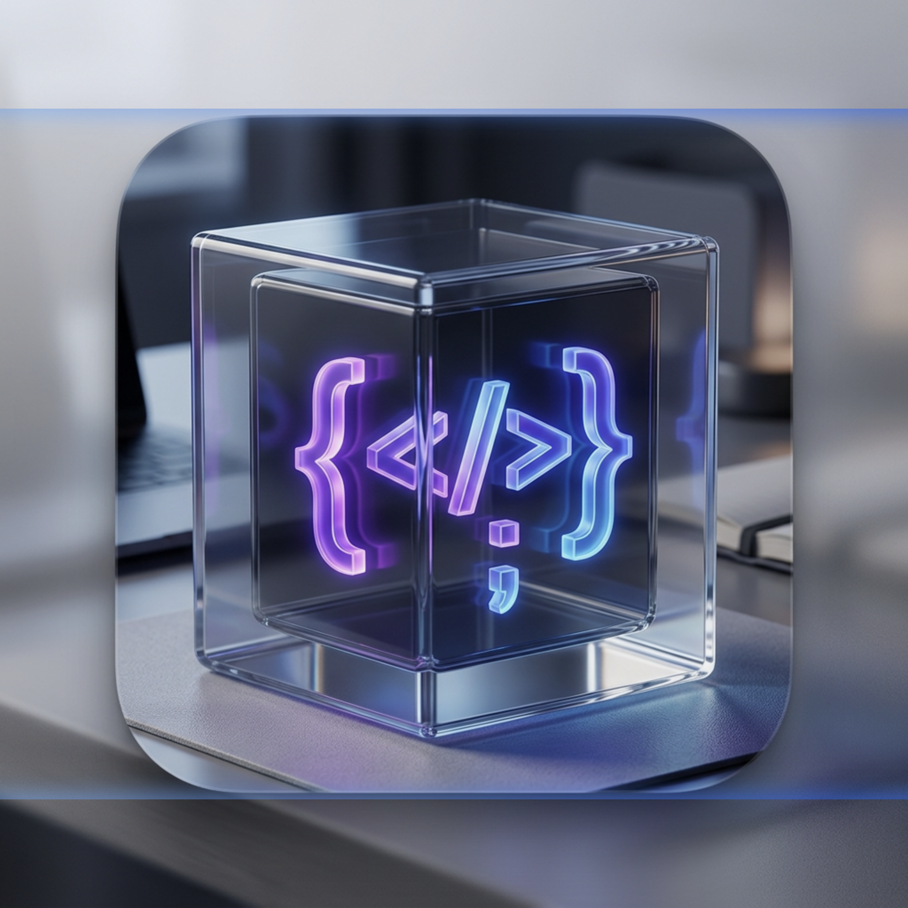

  

<h1 align="center">Snippet Box</h1>

  <strong>Премиальный менеджер сниппетов для разработчиков, которые ценят скорость и эстетику.</strong>

  
  
  
  

---

## ✨ Особенности

*   **🚀 Глобальный доступ**: Вызывайте Snippet Box из любого приложения с помощью настраиваемого горячего клавиши (по умолчанию `Cmd+Shift+X`).
*   **🧩 Умные переменные**: Используйте `{{variable}}` в своем коде. При копировании приложение предложит заполнить значения прямо в окне предпросмотра.
*   **🎨 Премиальный дизайн**: Современный интерфейс с поддержкой тем (Light/Dark), плавными анимациями на Framer Motion и Glassmorphism эффектами.
*   **🌐 Полная локализация**: Интерфейс и документация доступны на **Русском** и **Английском** языках.
*   **⚡️ Поддержка 14+ языков**: Подсветка синтаксиса через CodeMirror для JS, TS, Python, Rust, Go, SQL и многих других.
*   **📥 Мульти-файловые сниппеты**: Один сниппет может содержать несколько файлов — идеально для сложных компонентов или конфигураций.

---

## 🛠 Технологический стек

- **Core**: [Tauri 2](https://tauri.app/) (Rust) для безопасности и легкости.
- **Frontend**: [React 19](https://react.dev/) + [TypeScript](https://www.typescriptlang.org/).
- **Editor**: [CodeMirror 6](https://codemirror.net/) с кастомными расширениями для переменных.
- **Animations**: [Framer Motion](https://www.framer.com/motion/) для «живого» интерфейса.
- **Storage**: Локальное хранилище через `tauri-plugin-store`.

---

---

## 🚀 Как начать пользоваться

### 📥 Скачивание
Самый простой способ попробовать Snippet Box — скачать готовый инсталлятор для вашей операционной системы со страницы **[Releases](https://github.com/frenzybe/snippet-box/releases)**.

- Для **macOS**: Скачайте `.dmg` (поддерживаются как Intel, так и Apple Silicon).
- Для **Windows**: Скачайте `.msi` установщик.

### 🛠 Сборка (для разработчиков)
Если вы хотите внести вклад в разработку или собрать приложение самостоятельно:
1. Установите [Node.js](https://nodejs.org/) и [Rust](https://www.rust-lang.org/tools/install).
2. Запустите `npm install`.
3. Запустите `npm run tauri dev` для режима разработки.

---

## 📅 CI/CD

Проект настроен на автоматическую сборку через **GitHub Actions**. Каждый раз, когда код попадает в ветку `release` или создается новый релиз с тегом `v*`, GitHub автоматически генерирует пакеты для macOS и Windows.

---

## 📄 Лицензия

MIT © [Snippet Box Team]
