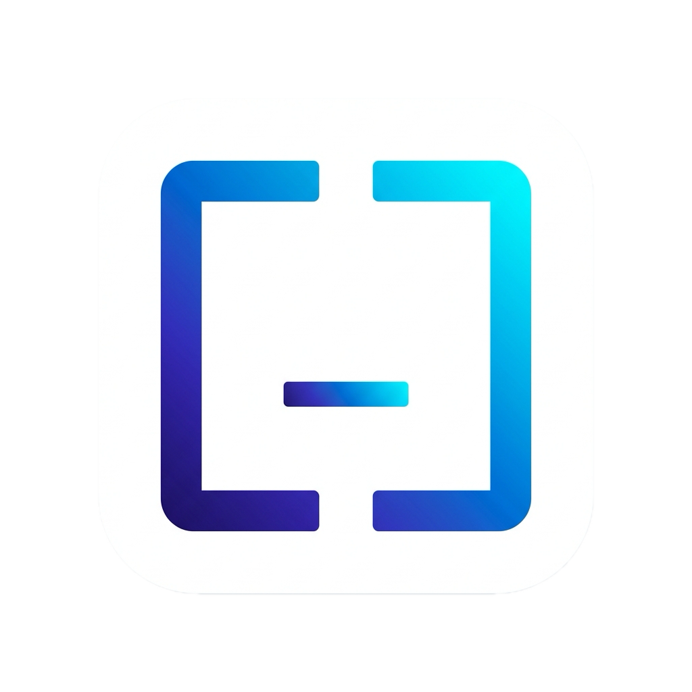

<p align="center">
  <br>
  
</p>

<h1 align="center">Snippet Box v2.0</h1>

<p align="center">
  <strong>Премиальный менеджер сниппетов для разработчиков. Скорость Rust, мощь SQLite, эстетика Apple.</strong>
</p>

<p align="center">
  
  
  
  
</p>

---

### ⚡️ Почему Snippet Box?

Snippet Box задуман не просто как хранилище кода, а как **продолжение ваших рук**. В мире, где контекст меняется каждую минуту, доступ к вашим лучшим решениям должен быть мгновенным.

| **🚀 Производительность** | **🎨 Дизайн** | **🔍 Умный поиск** |
| :--- | :--- | :--- |
| Написан на **Rust**. Мгновенный запуск, потребление RAM < 80MB и нулевой оверхед. | Нативная прозрачность **Mica/Acrylic**. Интерфейс, который чувствуется частью системы. | **FTS5 индексация** — ищите по коду среди тысяч файлов за миллисекунды. |

---

### 🔥 Ключевые возможности

- **⌨️ Глобальный хоткей**: Вызывайте и скрывайте приложение одной комбинацией из любой среды.
- **🧠 Умные переменные**: Используйте `{{vars}}` для создания динамических шаблонов. Заполняйте их на лету перед копированием.
- **📂 Глубокая организация**: Умные папки, теги и автоматические коллекции (Избранное/Недавнее).
- **🕒 История версий**: Мы храним все изменения. Случайно удалили важный кусок кода? Просто верните его из истории.
- **🦾 Мульти-файловость**: Один сниппет — это целый компонент. Храните `.tsx`, `.css` и `.test.ts` в одной карточке.
- **🌍 Мультиязычность**: Полная поддержка русского и английского языков «из коробки».

---

### 📦 Быстрая установка

#### **macOS**
1. Скачайте **[DMG-образ](https://github.com/frenzybe/snippet-box/releases)**.
2. Перенесите **Snippet Box** в папку `Applications`.
3. Чтобы запустить приложение без подписи, выполните в терминале:
```bash
xattr -cr /Applications/Snippet\ Box.app
```

#### **Windows**
1. Скачайте **[MSI-инсталлятор](https://github.com/frenzybe/snippet-box/releases)**.
2. После установки эффекты Mica (Windows 11) и Acrylic (Windows 10) включатся автоматически.

---

### 🛠 Разработка и Сборка

Если вы хотите собрать проект самостоятельно:

```bash
# Установка зависимостей
npm install

# Запуск в режиме разработки
npm run tauri dev

# Сборка готового пакета
npm run tauri build
```

---

<p align="center">
  <br>
  Сделано с любовью к коду. <b>Snippet Box Team © 2026</b>
  <br>
  
</p>
